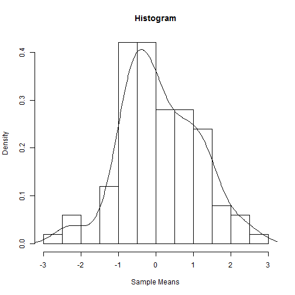

My Friend's Shiny Stat App
========================================================
author: Bill Eddins  

date: November 21 2015  

Introduction
========================================================

This application is written in R and uses the Shiny package. The application empowers a faculty member or student to explore statical concepts by changing sample parameters such as:

- Number of observations
- Mean
- Standard deviation
- Then, the app generates a list of random normals and
    - Shows a new histogram and
    - Overlays a density plot on the histogram
    
You can see the application at the following url:
https://weddins.shinyapps.io/StatApp

Discribing the application
========================================================

There are two options for writing a Shiny application: single file or two file. This project demonstrates the two file approach which requires the following:

- A file named `ui.R` that describes the input and
- A file named `server.R` describing how input flows into the output

Code demonstration
========================================================
The app graphs a random normal distribution (n=100, mu=0, sd=1) of sample means.

 

Summary
========================================================

So, there you have it. Shiny provides the following benefits:
- Very convenient html authoring
- A package that is fully integrated with R
- Technical features that provide ...
    - Distribution of statistical knowledge
    - Fast rendering of html and user interaction, and
    - Scalability and all that internet stuff

The reader is encoraged to get more information at the following url:
http://shiny.rstudio.com/

Or see the show case at the following url:
http://shiny.rstudio.com/gallery/

